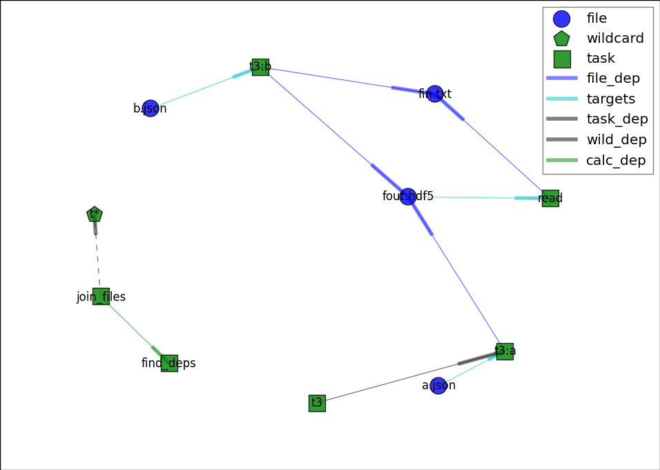

===========
doit-graphx
===========

A `doit <http://pydoit.org>`_ command plugin that generates graphical or textual dependency-graphs using the `NetworkX <http://networkx.github.io>`_ library.

.. contents::

Install
-------
It has been tested with python 2.7 and python 3.4, and 
it requires *doit* version >= 0.28, `networkx` and `matplotlib`.

You can either download the sources and install them in "development" mode
(so that you can follow development-changes)::

  $ git clone https://github.com/pydoit/doit-graphx.git
  $ cd doit-graphx
  $ pip install -r requirements.txt
  $ python setup.py develop
  

or you can install a snapshot directly from the latest source at github::

  pip install git+https://github.com/pydoit/doit-graphx.git

.. NOTE::
  Currently (as of March-2015) *doit-0.28* is not yet released, 
  so you have to install the latest version also from github::

    pip install git+https://github.com/pydoit/doit.git

  Use *pip*'s :option:`--ignore-installed` if you already have *doit* installed.

Usage
-----
To activate this *doit* plugin add a file named :file:`doit.cfg` into 
the root of your project with the following content::

  [command]
  cmd_graphx:Graphx

Now you can just use the `graphx` command::

  doit graphx
  doit graph                        ## open matplotlib frame, WILL CHANGE THIS!
  doit graph --deps file,calc,target --private
  doit graph --out-file some.png
  doit graph --graph-type json --out-file some.png

Multiple output-formats are supported, selected with the 
``--graph-type <format>`` option.  Type ``doit help graphx`` to see them.  
Most of them are automatically discovered from networkx's `write_XXX()` methods; 
see: http://networkx.github.io/documentation/latest/reference/readwrite.html

By default, results are written to standard output.

